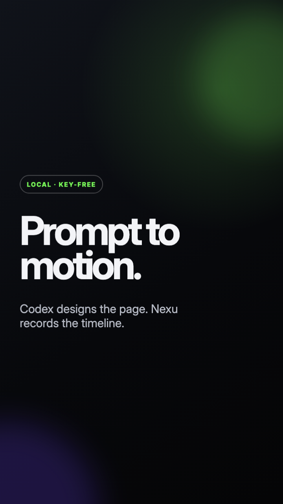
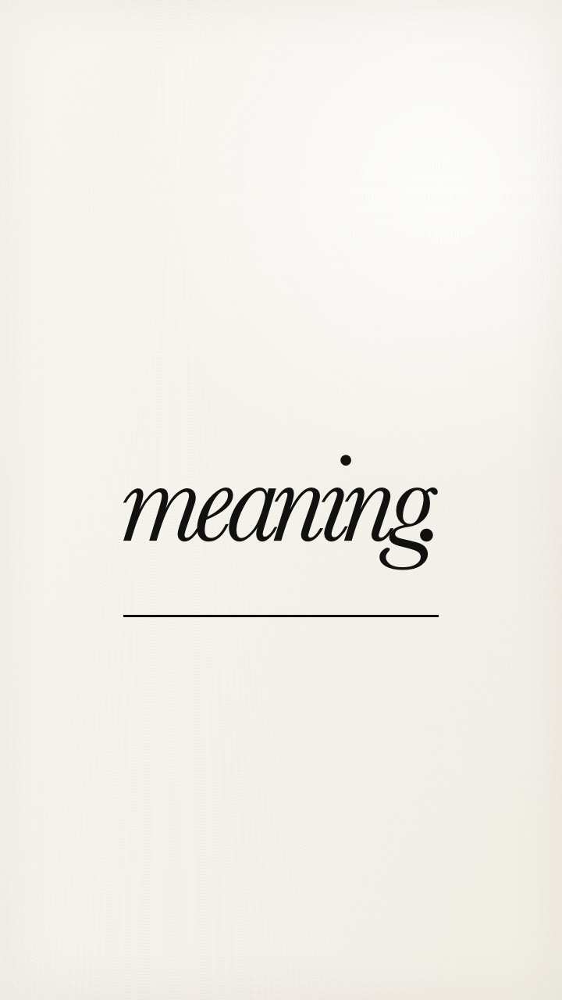
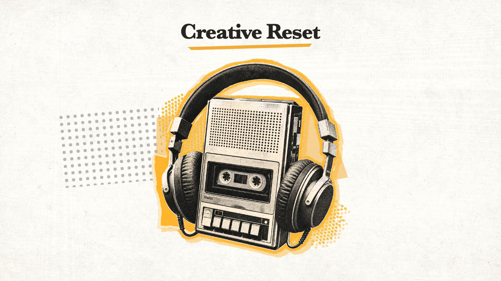

# Motion Design Open

Create motion graphics and captioned videos with Codex—without a separate AI API key.



Motion Design Open packages **Nexu Motion** as an installable Codex plugin. Codex can turn a prompt or rough voiceover into an editable HTML/CSS motion composition, advance the animation frame by frame in local Chrome, and export a synchronized MP4 with FFmpeg.

[Watch the short demo](docs/nexu-motion-demo.mp4)

## Full prompt control

Users control the subject, message, exact text, visual style, generated imagery, uploaded assets, duration, output format, colors, typography, pacing, transitions, captions, audio, and anything to avoid. Every result remains an editable HTML/CSS/JavaScript project, so follow-up prompts can revise one choice without locking the user into a flattened AI video.

## What it does

- Creates animated ads, reels, explainers, title sequences and kinetic typography.
- Generates original image layers, textures and posterized cutouts with Codex imagegen, then animates them locally.
- Keeps typography minimal with one clear reading target at a time.
- Transcribes voiceovers locally with word timestamps.
- Detects silence and flags possible coughs, breaths or handling noise for review.
- Removes dead air, false starts, repeated takes and verified unwanted audio.
- Rebuilds every caption timestamp after audio cuts.
- Corrects currencies, names, numbers and locations with time-scoped transcript edits.
- Produces word-highlighted motion captions synchronized to edited audio.
- Renders vertical, square or landscape H.264 MP4 video locally.
- Includes optional MCP tools for structured scene creation and rendering.

## Install in Codex

Add this GitHub repository as a plugin marketplace:

```bash
codex plugin marketplace add eldhosajugittttt/Motion-design-open
```

Then:

1. Restart the ChatGPT desktop app.
2. Open **Codex → Plugins**.
3. Choose **Motion Design Open**.
4. Install **Nexu Motion**.
5. Start a new Codex task.

In Codex CLI, enter `/plugins` after adding the marketplace and install **Nexu Motion** from the marketplace browser.

## Requirements

- Node.js 20 or newer
- Google Chrome, Chromium or Microsoft Edge
- FFmpeg and FFprobe
- Python 3.9 or newer for audio analysis and caption rebuilding
- A local Whisper engine for transcription:
  - Apple Silicon: `python3 -m pip install mlx-whisper`
  - Other platforms: `python3 -m pip install faster-whisper`

Whisper model files are downloaded on first use and run locally. No transcription API key is required.

## Example prompts

### Prompt to motion

> Use Nexu Motion to create a six-second vertical launch ad for a running shoe. Use kinetic typography, electric lime accents and a dramatic product reveal.

### Rough audio to finished video

> Use Audio to Motion on this voiceover. Remove coughs, repeated takes and long dead gaps, correct the transcript, rebuild the captions and create a 9:16 motion graphic synchronized to the edited audio.

### Caption-first social video

> Turn this interview clip into a 30-second square video. Keep the strongest answer, remove filler and pauses, add word-highlighted captions and export an editable project plus MP4.

### Minimal editorial typography

> Use Motion Typography to create a five-second warm-paper video for “Less text. More meaning.” Show one word at a time with an editorial serif and restrained italic pairing.

For a sentence-led version, ask for a restrained typewriter reveal and a clear final hold. A reading target may be a word, line or short sentence.

[Watch the five-second typography sample](docs/motion-typography-sample.mp4)



### Imagegen to grunge motion

> Use Imagegen to Motion to study this reference video, generate an original posterized cutout and paper texture, and animate them with halftone, typewriter copy and marker highlights. Do not reuse the reference footage or audio.

[Watch the imagegen grunge sample](docs/imagegen-grunge-poster-motion.mp4)



## How the audio workflow stays synchronized

```text
source audio
  → local transcription with word timestamps
  → silence and non-speech review
  → auditable edit-decision list
  → edited audio
  → mathematically remapped word timings
  → motion captions
  → frame-by-frame video render
```

The motion stage never reuses the original timestamps after cuts. `caption-data.json` from the edited timeline is the only timing source.

## Included skills

- `nexu-motion` — prompt-to-motion web compositions and deterministic video rendering.
- `audio-to-motion` — audio analysis, local transcription, editorial cuts and caption remapping before animation.
- `motion-typography` — minimal copy, editorial font pairing, sequential beats and deterministic typewriter reveals.
- `imagegen-to-motion` — generated raster layers, chroma cutouts, editable collage motion and grunge-poster workflows.

## Privacy

Audio, transcripts, animation pages and renders stay on the local machine. The plugin does not call an external AI API. Installing a local Whisper model may download model weights from Hugging Face the first time it is used.

## Project structure

```text
.agents/plugins/marketplace.json   Codex marketplace catalog
plugins/nexu-motion/               Installable plugin
  .codex-plugin/plugin.json        Plugin manifest
  .mcp.json                        Local MCP server configuration
  skills/nexu-motion/              Motion graphics workflow and recorder
  skills/audio-to-motion/          Audio editing and caption workflow
  skills/motion-typography/        Minimal editorial kinetic typography
  skills/imagegen-to-motion/       Generated artwork to editable motion workflow
  mcp/                             Structured scene tools and renderer
docs/                              Poster and demo
```

## Development

Run the plugin tests:

```bash
cd plugins/nexu-motion
npm test
python3 -m unittest discover -s skills/audio-to-motion/tests -v
```

Run the bundled motion demo:

```bash
npm run demo
```

## License

MIT
